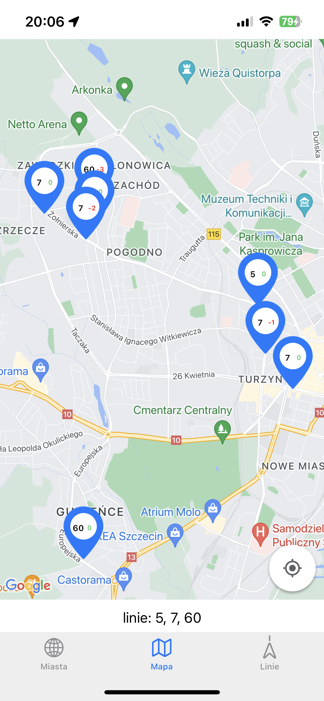
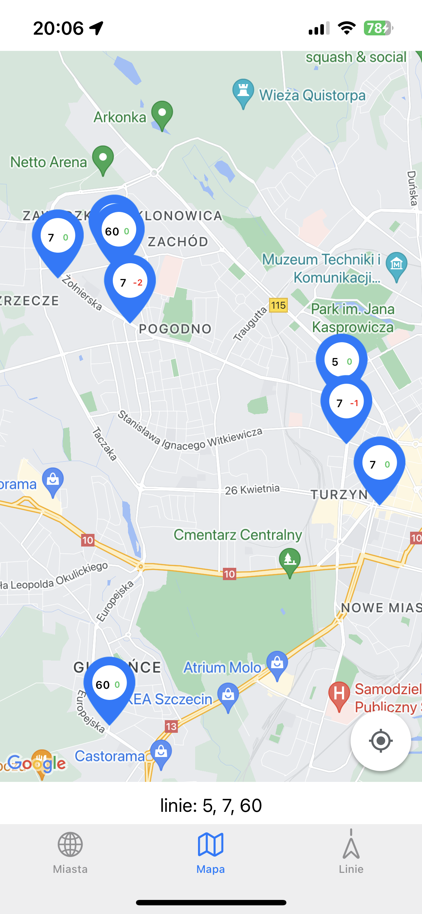
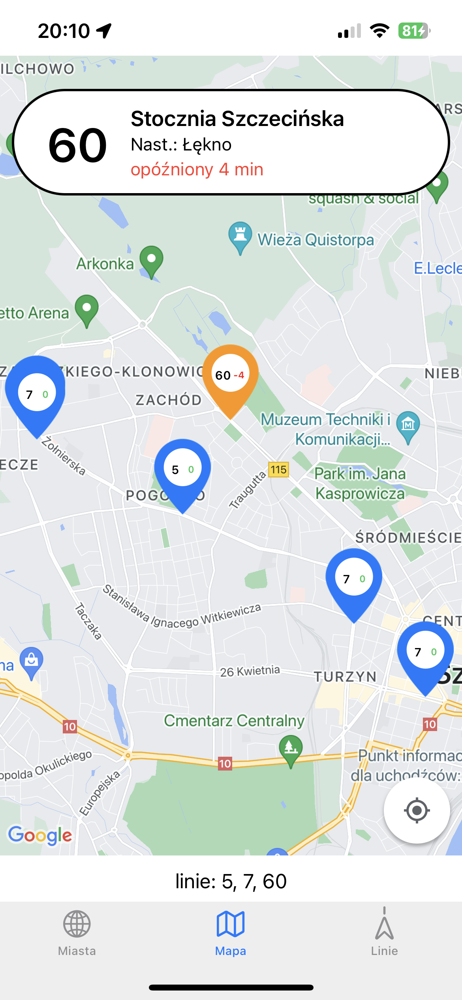
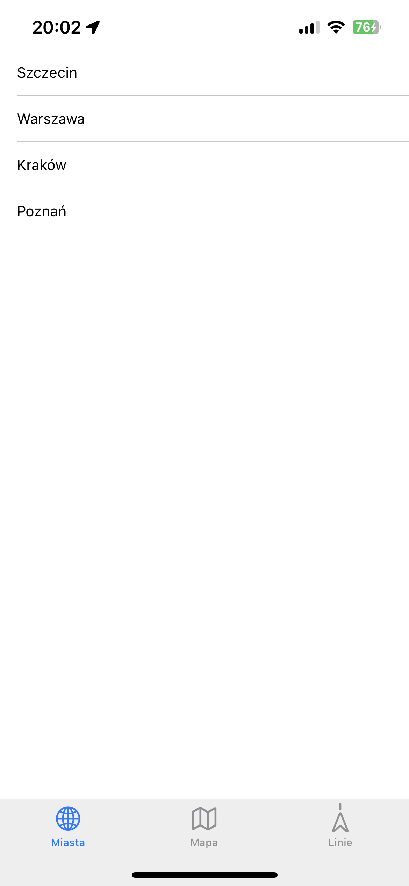

# LiveBus

Application for tracking location of public transport vehicles 

<ul>
<li>Created as a diploma thesis</li>
<li>Used for non-commercial purposes</li>
</ul>

## How it looks like?

Application uses Timer to update location of vehicles every second\*

*<cite>in the end it all depends on data provider</cite>

<table style="margin-left:auto; margin-right:auto">
<tr>
<td>
 <figure align="center">
   
  <figcaption><cite>before updating location</cite></figcaption>
</figure>
 </td>
<td> 
<figure align="center">
   
  <figcaption><cite>after updating location</cite></figcaption>
</figure>
 </td>
</tr></table>

## More information about a vehicle

<figure align="center">
  
  <figcaption><cite>after selecting a vehicle</cite></figcaption>
</figure>

## Selecting a City

#### For now application supports only one city: Szczecin

 <figure align="center">
  
  <figcaption><cite>selecting a city (View)</cite></figcaption>
</figure>

## Selecting Lines to show on the map

 <figure align="center">
  
  <figcaption><cite>selecting lines</cite></figcaption>
</figure>

## Requirements

<ul>
<li>Cocoapods</li>
<li>Google Account</li>
<li>Google Maps API Key <cite>(free for the first 3 months)</cite></li>
</ul>

## Data Providers

<ul>
<li>ZDiTM <cite>(thx)</cite</li>
</ul>
